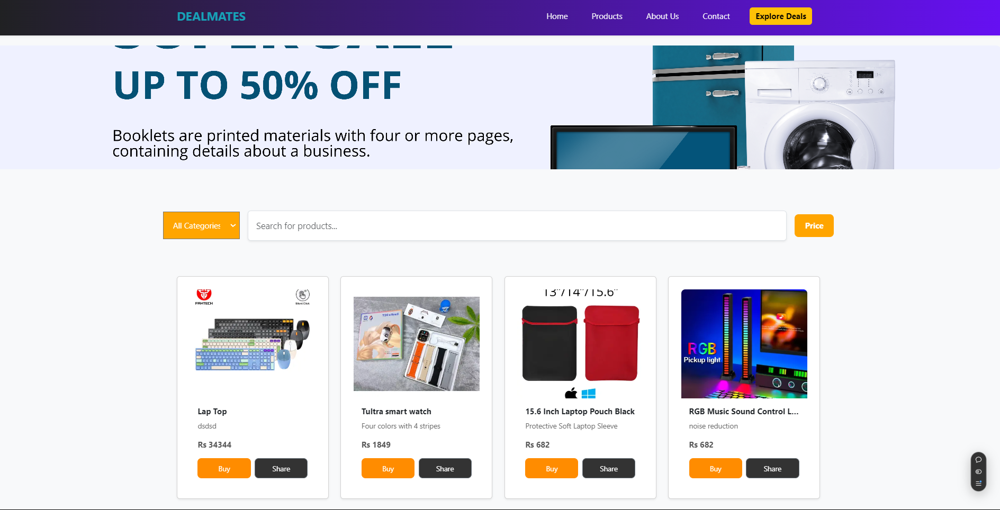

# 🌟 DealMates - Affiliate E-Commerce Platform

  
*(Replace with your banner image path or hosted link)*  

Welcome to **DealMates**, a cutting-edge affiliate e-commerce platform seamlessly integrated with the **Daraz Affiliate Program**. Discover and share the best deals, manage products effortlessly, and earn rewards by promoting Daraz products.  

🌐 **Live Website**: [Visit DealMates](https://deal-mates-online-store.vercel.app/)

---

## ✨ Overview

**DealMates** is your ultimate solution for sharing affiliate deals and earning commissions. With its seamless integration with Daraz, DealMates allows users to:
- 🛍️ **Browse Products**: Access top-quality deals from Daraz's extensive catalog.
- 🤝 **Affiliate Program**: Share product links and earn commissions for purchases.
- 🛠️ **Product Management**: Effortlessly add, edit, and manage products.
- 📱 **Mobile-Friendly Design**: Enjoy a responsive and modern interface across devices.

---

## 🛠️ Tech Stack

| **Component**        | **Technology**               |  
|-----------------------|------------------------------|  
| 🌐 **Frontend**      | React.js, React-Bootstrap, Axios, Styled Components |  
| 🖥️ **Backend**       | Node.js, Express.js, MongoDB, Mongoose |  
| 🚀 **Deployment**    | Heroku, GitHub Actions |  
| 🌐 **Affiliate API** | Daraz Affiliate API          |  

---

## ✨ Features

### User Features
- 🛍️ **Browse Products**: View a wide range of products integrated via Daraz’s API.
- 🔍 **Search and Filter**: Quickly locate specific products using search and filter options.
- 🤝 **Share and Earn with Daraz**:
  - Generate affiliate links using the Daraz Affiliate API.
  - Share links on social media, blogs, or directly with your network.
  - Earn commissions for purchases made through your links.

### Admin Features
- 🛠️ **Product Management**:
  - Add new products manually or fetch from the Daraz API.
  - Edit product details like title, price, and images.
  - Delete outdated or unavailable products.

---

## 🎨 Key Highlights

- **Daraz API Integration**: Fetch products directly from Daraz for real-time inventory updates.
- **Affiliate Earnings Dashboard**: Track commissions earned through shared links.
- **Responsive Design**: Built with **React-Bootstrap** for consistent functionality across devices.
- **Custom Styling**: Polished user interface created using **Styled Components**.

---

## 🚀 How to Get Started

### Prerequisites
- Node.js and npm installed.
- MongoDB database setup.
- **Daraz Affiliate Account** (Sign up [here](https://affiliate.daraz.lk)).

